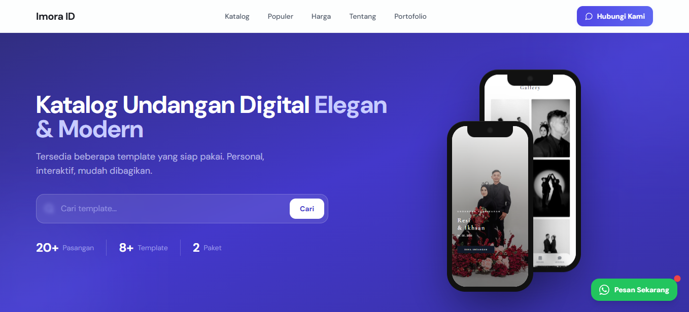
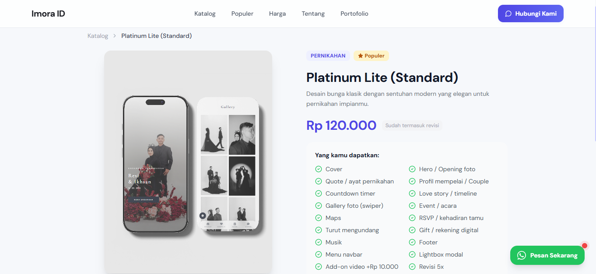
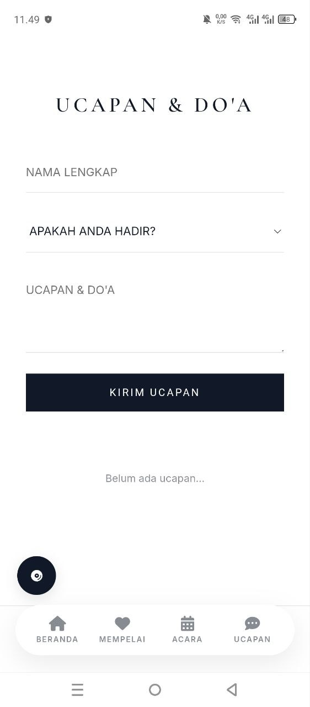

# Laravel Digital Invitation System

Web application for digital wedding invitations built using Laravel 12 and MySQL.


---

## ✨ Features

- Digital invitation pages
- RSVP system
- Gallery section
- Countdown timer
- Custom invitation templates
- Responsive mobile design
- Admin dashboard
- Portfolio showcase

---

## 🛠️ Tech Stack

- Laravel 12
- PHP
- MySQL
- Bootstrap
- JavaScript
- Git & GitHub

---

## 📸 Preview

### Landing Page



### Invitation Template



### RSVP Feature



### Mobile View


---

## 🌐 Live Demo

Website:
https://imora.id

---

## ⚙️ Installation

```bash
git clone https://github.com/Dikaramadhan/imora-demo.git

composer install

cp .env.example .env

php artisan key:generate

php artisan migrate

php artisan serve
```

---

## 👨‍💻 Author

Dhika Ramadhan

GitHub:
https://github.com/Dikaramadhan
